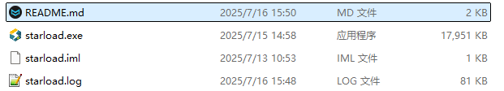
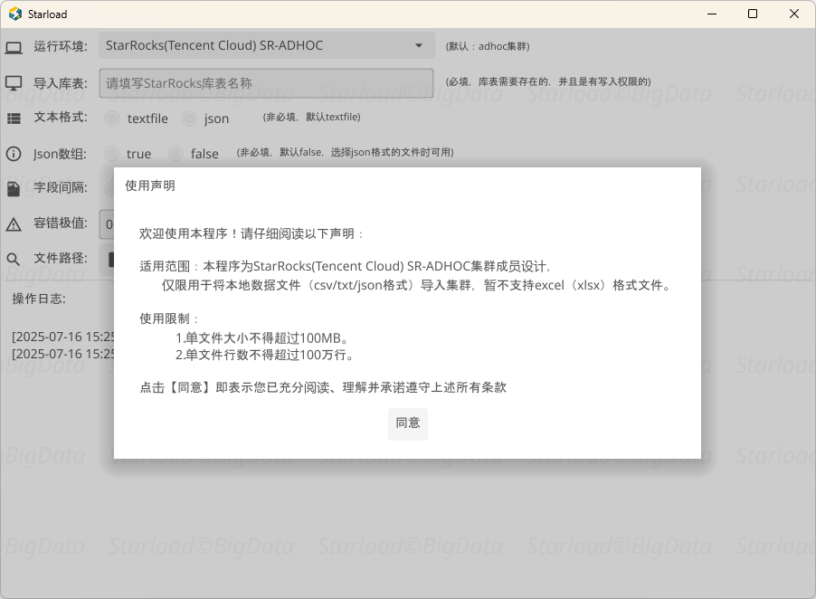
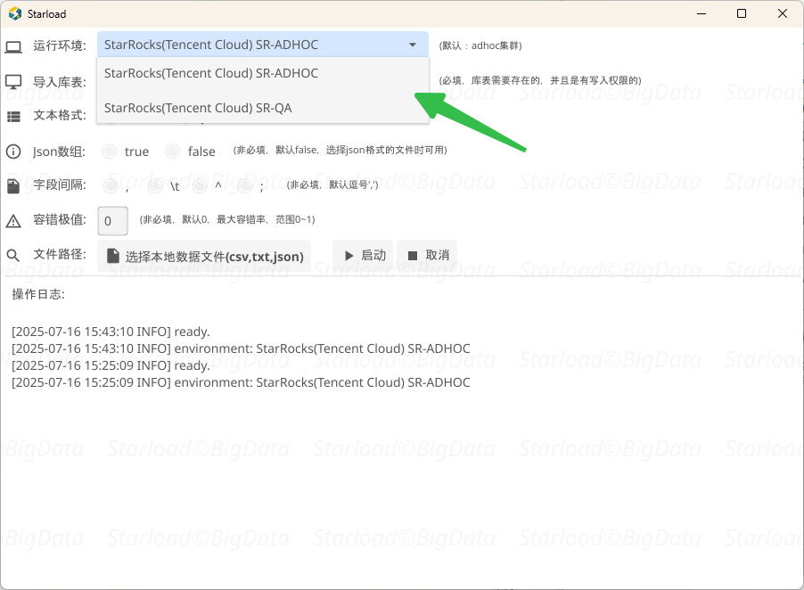
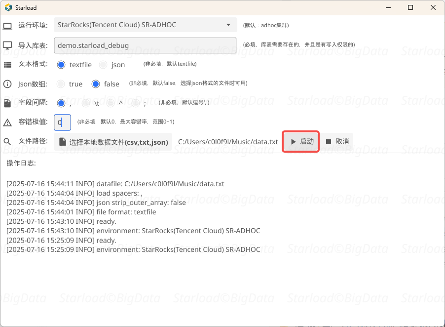
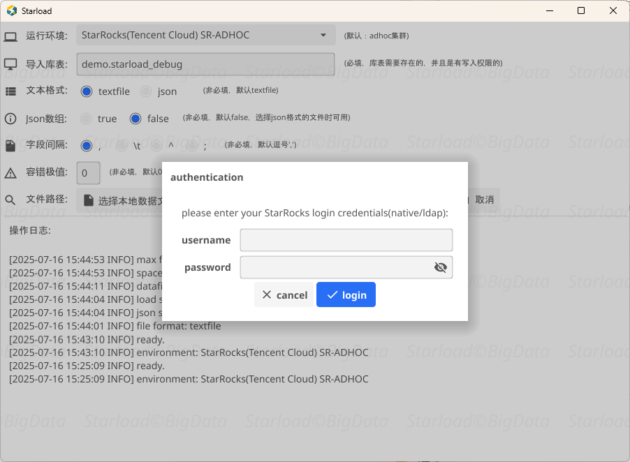
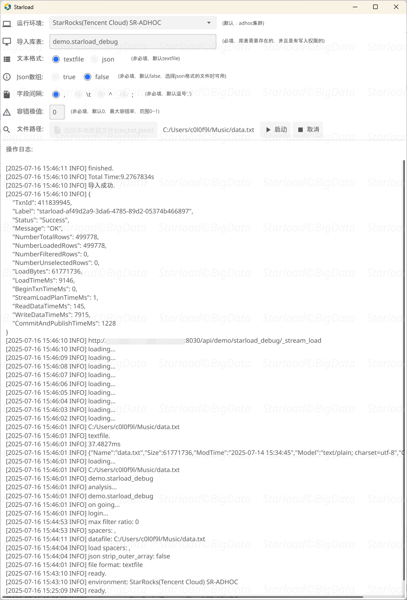
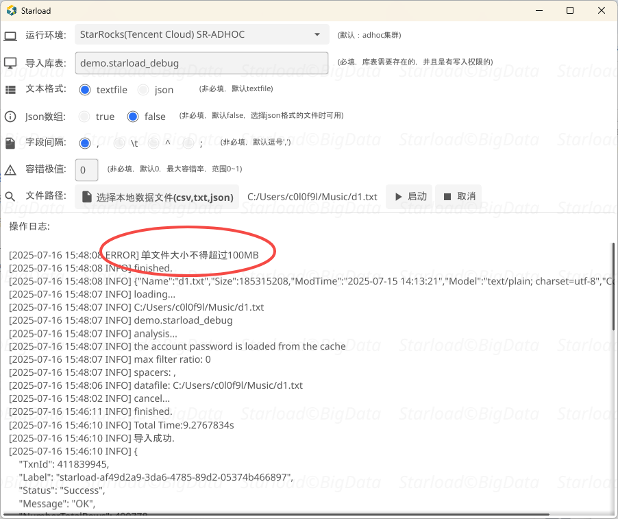

**Starload** - Stream load (windows版)

**背景**

针对非技术(自助分析)用户在使用第三方数据库工具（如Dbeaver）导入文件数据至StarRocks时存在的技术风险，因此开发一个专用的数据导入工具。该解决方案旨在解决以下核心问题：

性能瓶颈：第三方工具普遍采用insert value语句，数据量大时可能引发StarRocks系统性能下降
管控缺失：无法有效拦截GB级或百万行以上的大规模数据导入
稳定风险：未经管控的大文件导入可能导致BE节点服务中断
工具特性：

友好界面：采用图形化操作设计，简化用户操作流程
标准协议：基于stream load协议实现高效数据导入
安全管控：内置数据量级控制，保障集群稳定性
去命令化：通过可视化交互降低使用门槛
目标用户：本工具主要面向需要简单、安全地完成数据导入操作的非技术用户群体，提供标准化的数据接入解决方案

**介绍**

starload.exe启动，弹出使用声明，限制条件

支持多个集群

选择、填写必填信息，点击【启动】

弹出输入StarRocks账号密码，与原生无异都是支持native与ldap校验方式

50w，9秒

假设触发了限制

1.单文件大小不得超过100MB。  
2.单文件行数不得超过100万行。

触发熔断

具体可以在import.go源码中修改限制条件再打包

跟stream load一样，支持textfile和json，正在集成xlsx，方便自助分析用户傻瓜式操作。

配置和打包： 由于这里属于cs模式并且使用到gcc进行打包，代码里面下面的配置需要更改并打包：

1.lark/lark_send_markdown.go  使用飞书代理，const larkproxy = "设置飞书代理"

2.util/def.go  				  指定集群默认连接地址，const ( StarRocksServer = "生产SR连接地址" StarRocksServerQa = "测试SR连接地址" )

3.conn/ConnectMySQL.go        修改mysql库的链接信息

4.init/init.go 				  这里使用了一个mysql配置表：chengken.starrocks_starload_cf，这里管理着版本的可用性。

